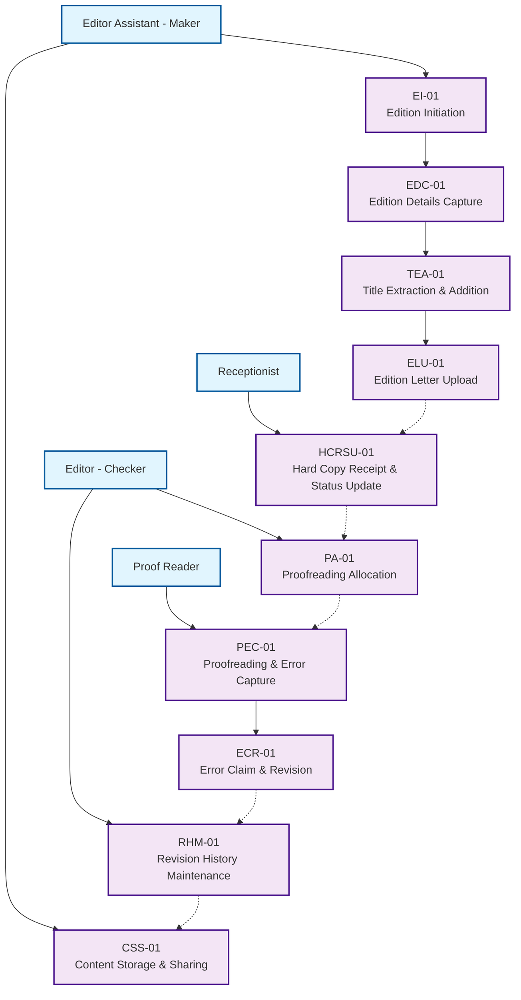
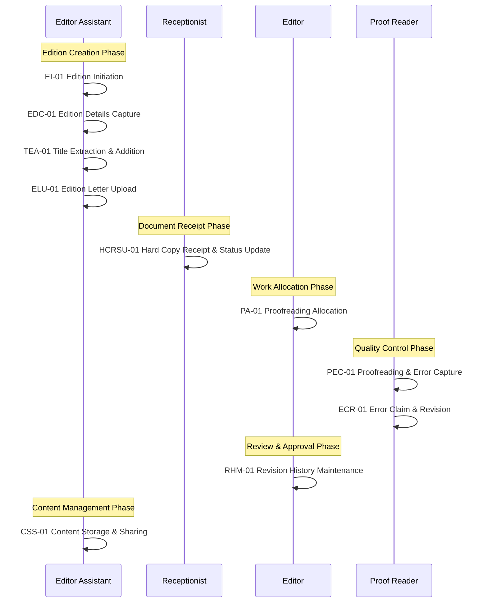
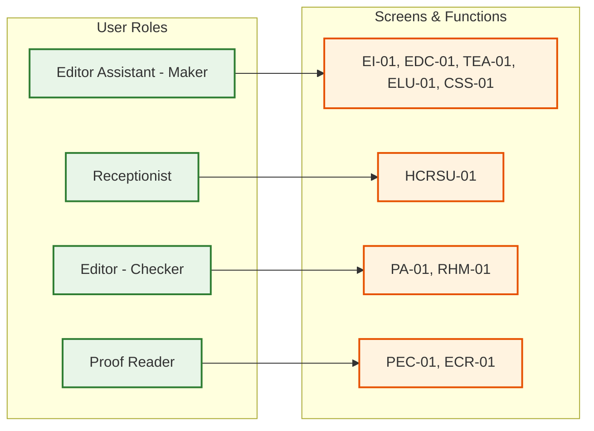
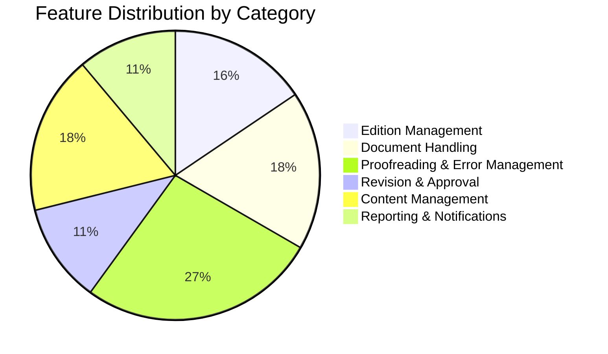
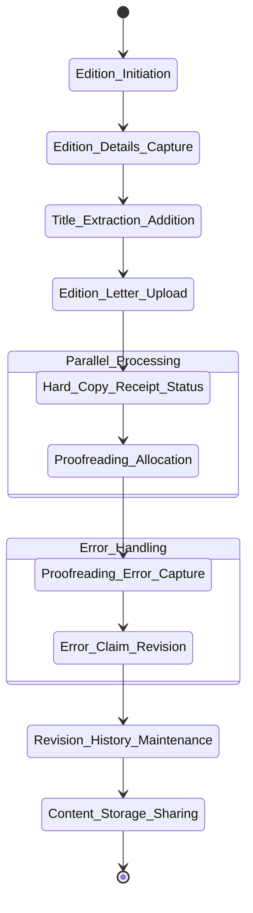

# Editorial Module Workflow Diagram



## Workflow Sequence Diagram



## Role Responsibility Matrix



## Feature Category Overview



## Workflow State Diagram



## Data Flow Diagram

```mermaid
flowchart TD
    %% Data Sources
    DS1[Academic Year Data]
    DS2[Edition Details]
    DS3[Title Information]
    DS4[Document Files]
    DS5[Error Data]
    DS6[Content Data]

    %% Process Steps
    P1[EI-01<br/>Process]
    P2[EDC-01<br/>Process]
    P3[TEA-01<br/>Process]
    P4[ELU-01<br/>Process]
    P5[HCRSU-01<br/>Process]
    P6[PA-01<br/>Process]
    P7[PEC-01<br/>Process]
    P8[ECR-01<br/>Process]
    P9[RHM-01<br/>Process]
    P10[CSS-01<br/>Process]

    %% Data Flow
    DS1 --> P1
    DS2 --> P1
    P1 --> P2
    DS3 --> P2
    P2 --> P3
    P3 --> P4
    DS4 --> P4
    P4 --> P5
    P5 --> P6
    P6 --> P7
    DS5 --> P7
    P7 --> P8
    P8 --> P9
    P9 --> P10
    DS6 --> P10

    %% Styling
    classDef processClass fill:#f3e5f5,stroke:#7b1fa2,stroke-width:2px
    classDef dataClass fill:#e3f2fd,stroke:#1976d2,stroke-width:2px

    class P1,P2,P3,P4,P5,P6,P7,P8,P9,P10 processClass
    class DS1,DS2,DS3,DS4,DS5,DS6 dataClass